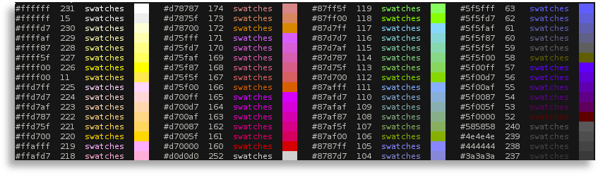
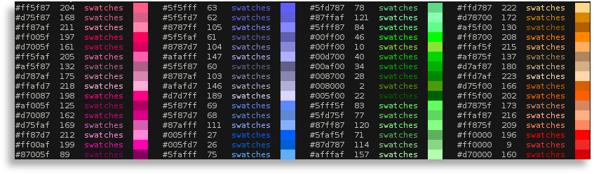
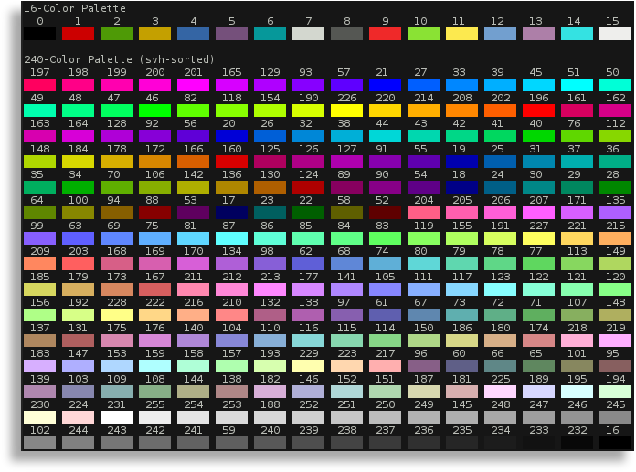
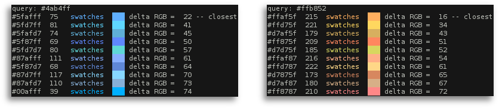
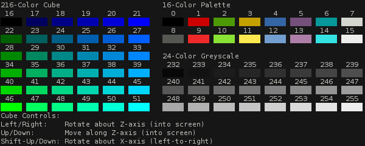

# Swatches

## Overview

*Swatches* is a program for looking at all the colors your terminal can display, and you can use a variety of different formats to do so. *Swatches* is written entirely in Haskell using [Brick](https://hackage.haskell.org/package/brick), and should run in both Linux and MacOS terminals, but probably not Windows (I've only tested it with Linux).

Below are a few examples of what you can do with *Swatches*; however, for a description of everything possible with *Swatches*, try running `swatches --help | less`.

### View colors sorted by RGB values

By default, *Swatches* will display the default RGB hexcode, the ANSI code, a colored string and a colored swatch for each color. The colors can be sorted (descending) by the default RGB values in the that order (i.e., red, then green and finally blue) by running `swatches -s rgb` to get:



(Note that the screen has been cropped in this example, and any user-defined colors may have an incorrect hexcode, which will be based on the default values (e.g., the ANSI 11 and 15 colors in the above image).)

### View colors sorted by HSV values

You can also sort (descending) the default output format by the hue, saturation and value of each color. In this case, the command is `swatches -s hsv` to get:



(Note that the screen has been cropped in this example, and any user-defined colors may have an incorrect hexcode, which will be based on the default values (e.g., the ANSI 9 color in the above image).)

### Sort the colors any way you want

The `-s/--sort` option will take any `rgb` or `hsv` triple for sorting. Likewise, you can sort by the ANSI codes using `--sort=ansi` option. For example, if the `-s/--sort` option is not used, the default triple is `svh` (i.e., sort by saturation, then value and finally hue), which gives rainbows of decreasing saturation. All sorts are descending by default; however, you can get ascending sorts by using the `-a` option.

### View colors in a compact block

The default display takes up a lot of space; however, you can use the `block` mode to display everything more compactly with just the ANSI code and a color swatch. You can sort the colors in this mode too using the `-s/--sort` option; however, the first 16 colors are displayed separately. For example, running `swatches block`, which will use the default `hsv` sort (right-to-left), gives the following output:



### Find best hexcode matches

If you know the hexcode of the color you want, then you can try to find the ten closest matches available based on the default hexcodes of the 256 terminal colors. For example, if you want to match the light-blue color `#4ab4ff`, then try `swatches match 4ab4ff`, and if you want to match the orange color `#ffb852`, then try `swatches match ffb852`, to get:



(Note that some matches may be incorrect if you have redefined some of the colors in your terminal from their default values. This will likely be the case for the first 16 ANSI colors.)

### View colors using an interactive 3D RGB-cube

In a 256-color terminal, 216 of the colors form a discrete 6x6x6 RGB space. You can use *Swatches* to view and manipulate this "RGB-color-cube" interactively using the `swatches cube` command:



(In this GIF, the ANSI 224 and 194 colors are not displaying quite right, which is likely due to the limited colors available to the GIF format. The colors should appear correctly in a 256-color terminal.)

### Getting help

Swatches comes equipped with extensive help that details all of its features and usage. You can display help by running
```sh
swatches --help | less
```

## Compiling, installation and uninstallation

*Swatches* uses the [Haskell Tool Stack](https://docs.haskellstack.org/en/stable/README/). Clone the repository and build with
```sh
git clone https://github.com/MWRuszczycky/swatches.git
cd swatches
stack build
```
You can then run *Swatches* isolated within the repository using
```sh
stack exec swatches
```
Alternatively, you can install swatches locally using
```sh
stack install
```
instead of `stack build` from within the repository. *Stack* will tell you where the binary has been locally installed (e.g., `~/.local/bin`) in case you want to later uninstall *Swatches*. Now you can run the program anywhere by just typing `swatches` at the terminal.

You can remove *Swatches* by simply deleting the associated binary and repository, because it does not maintain any configuration files, etc.

## Terminal settings

By default *Swatches* sets the `TERM` environment parameter to `xterm-256color`. You can change this by using the `--terminal=MYTERM` option.

## To do

1. Some functions still need commenting.
2. Add option to change the number of matches displayed rather than the default 10.
3. See if there is a better way to handle or warn about user-defined colors resulting in incorrect hexcodes.
